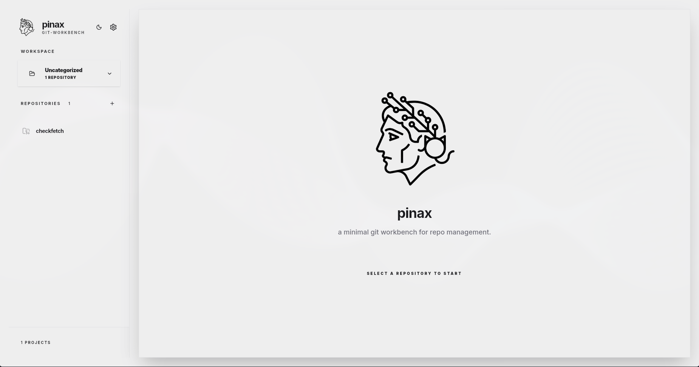
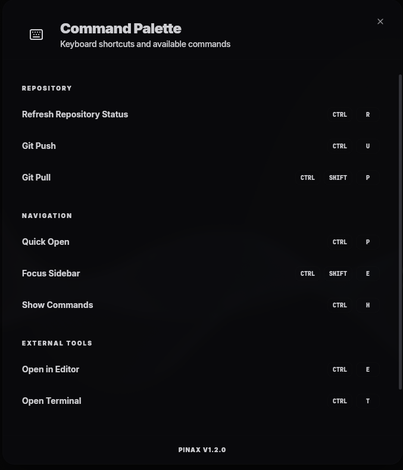
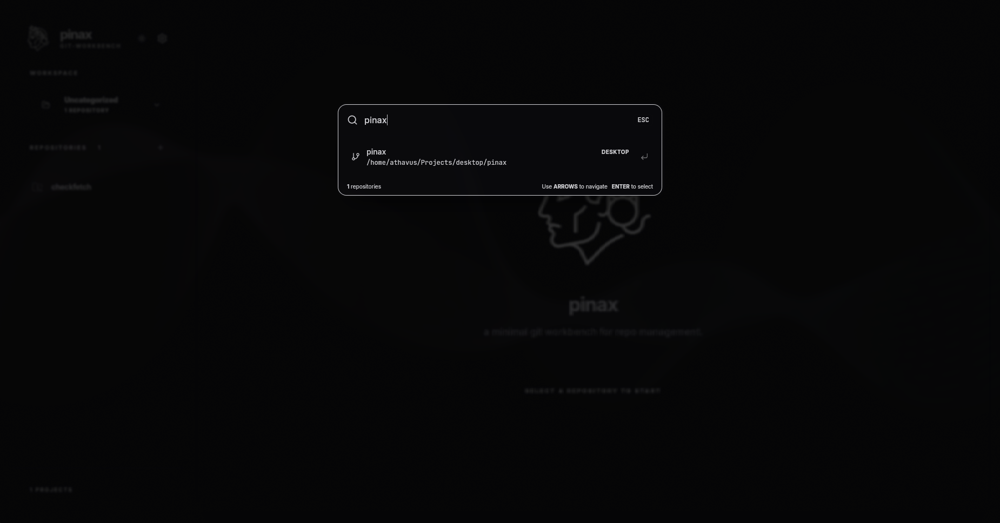
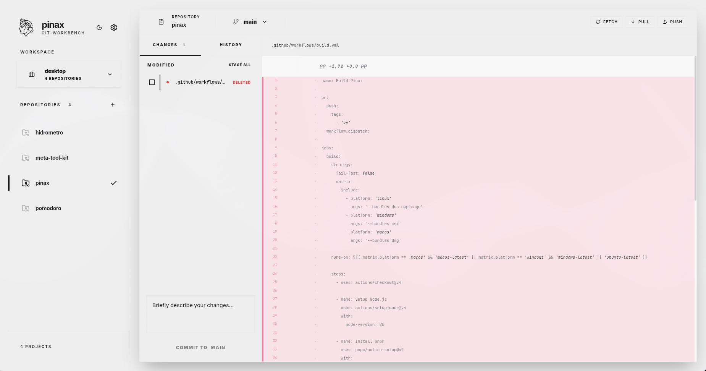

# Pinax

Um clone do GitHub Desktop para Linux, construído com Tauri e React. FOI COMPLETAMENTE FEITO COM O ANTIGRAVITY PARA TESTES DE POTÊNCIA DO EDITOR DE CÓDIGO.



## Pré-requisitos

- **Git**: Para clonar o repositório.
- **Linux**: Este projeto é focado no ecossistema Linux.

## Instalação (Recomendado)

O projeto inclui um script de instalação automatizado que detecta sua distribuição, instala as dependências do sistema (Rust, Node.js, bibliotecas gráficas) e compila o projeto.

```bash
# 1. Clone o repositório
git clone https://github.com/seu-usuario/pinax.git
cd pinax

# 2. Execute o script de instalação
chmod +x install.sh
./install.sh
```

Isso irá gerar os pacotes `.deb`, `.AppImage` e (se estiver no Arch Linux) `.pkg.tar.zst` na pasta `src-tauri/target/release/bundle/`.

## Desenvolvimento

Para rodar o projeto em modo de desenvolvimento (com Hot Module Replacement):

```bash
# Instale as dependências do projeto
pnpm install

# Inicie o modo de desenvolvimento
pnpm tauri dev
```

## Utilização da aplicação

Para utilizar a aplicação com clareza, siga os comandos descritos no manual que pode ser visto ao apertar Ctrl + H, ou nessa imagem abaixo:



## Galeria de Screenshots do Projeto

### Screenshot 1


### Screenshot 2


### Screenshot 3

